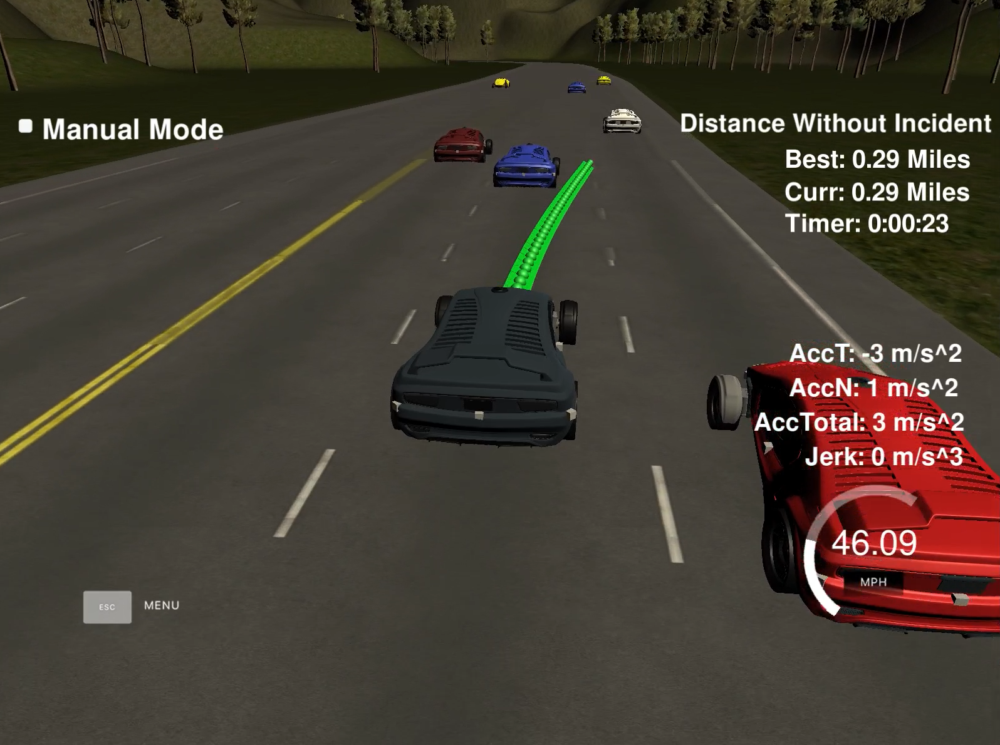

# Path Planner for Autonomous Driving on Highways
---
### Contents

1. [Overview](#overview)
2. [Demo](#demo)
3. [Dependencies](#dependencies)
4. [Design](#design)
5. [Basic Build Instructions](#basic-build-instructions)
6. [About the Simulator](#about-the-simulator)

### Overview

This is a primitive path planner for highway driving. It tries to always go as closely to a set speed limit as possible and move around slower traffic on the road if it is safe to do so. This program is written to communicate with the simulator linked below in order to visualize the output trajectories.

The master branch currently contains a version of the planner where a planned path always gets executed in its entirety, i.e. the initiation of a new maneuver is only possible after the last path point of the current path the car is following. This obviously leads to a trade-off between longer planning horizons and timely reaction to sudden changes in the environment. The flexible paths branch provides a version of the planner that remedies this limitation by introducing the ability to manually set the number of points of a path that will be executed before the current path can be changed entirely. This allows for both long planning horizons, which lead to better decisions, and almost arbitrarily fast reactions to sudden environmental changes, such as another car suddenly cutting in on the target lane that the ego car is trying to change onto.

### Demo

Check out the two videos below to watch the path planner in action. Click on the image to watch the master branch version of the path planner, or click on the link below the image to watch the version with flexible paths. The latter uses a longer planning horizon and you can see how the last portion of the path suddenly adjusts when the planner changes its decision about the optimal path based on new information about the ego car's surroundings.

[](https://www.youtube.com/watch?v=ZfNJykio03E)

Watch the flexible paths version here:

https://www.youtube.com/watch?v=G1UPA72iZE4

### Dependencies

* cmake >= 3.5
 * All operating systems: [click here for installation instructions](https://cmake.org/install/)
* make >= 4.1
  * Linux: make is installed by default on most Linux distros
  * Mac: [install Xcode command line tools to get make](https://developer.apple.com/xcode/features/)
  * Windows: [Click here for installation instructions](http://gnuwin32.sourceforge.net/packages/make.htm)
* gcc/g++ >= 5.4
  * Linux: gcc / g++ is installed by default on most Linux distros
  * Mac: same deal as make - [install Xcode command line tools]((https://developer.apple.com/xcode/features/)
  * Windows: recommend using [MinGW](http://www.mingw.org/)
* [uWebSockets](https://github.com/uWebSockets/uWebSockets)
  * Run either `install-mac.sh` or `install-ubuntu.sh`.
  * Or if you install from source, checkout to commit `e94b6e1`, i.e.
    ```
    git clone https://github.com/uWebSockets/uWebSockets
    cd uWebSockets
    git checkout e94b6e1
    ```
* If you want to watch the path planner in action in the simulator, you can download it [here](https://github.com/udacity/self-driving-car-sim/releases). Make sure to download the latest Term 3 Simulator release.

### Design

#### Main Components

This path planner consists of three main components:

* A [predictor](src/predictor.h) that uses sensor fusion data of the current states of other objects on the road and predicts their future states.
* A [behavior planner](src/behavior_planner.h) that uses the ego car's current state and trajectory and the predictions of other the objects' future states to decide what the ego car should do next.
* A [trajectory generator](src/trajectory_generator.h) that generates low-jerk trajectories to execute the behavior planner's decision.

#### Inputs and Outputs

The path planner needs the following inputs and produces the following outputs:

Inputs:

Inputs needed to initialize the path planner:
* A [map of the world](data/higway_map.csv) (i.e. of the highway, which must be a loop) in CSV format that contains waypoints along the center line of the highway in the format `[x,y,s,dx,dy]`:
  * `(x, y)` are the Cartesian coordinates of the waypoint in meters.
  * s is the Frenet longitudinal displacement coordinate in meters. The Frenet s coordinate in the provided highway map in this repository goes from 0 to 6945.554 meters for one full loop.
  * `(dx, dy)` define the unit normal vector to the highway's center line pointing outward of the highway loop.
* The constant number of lanes on the highway.
* The constant speed limit on the highway.
* The planning desired horizon in seconds.
* A Gaussian Naive Bayes classifier object as described below.

Inputs needed for each planning cycle:
* The ego car's noise-free localization data in the format `[x, y, s, d, yaw, speed]`:
  * `(x, y)` are the Cartesian coordinates of the car's last measured location in meters.
  * `(s, d)` are the Frenet coordinates of the car's last measured location in meters. `s` is the longitudinal displacement, i.e. how far along the road the car is from the origin, and `d` is the lateral displacement with its origin at the center line of the road, i.e. how far orthogonally from the center of the road the car is.
  * `yaw` is the angle of the car's heading measured counter-clockwise against the x-axis in degrees.
  * `speed` is the L2 norm of the car's velocity vector in meters per second, i.e. the car's scalar velocity.
* The list of previous path points that the ego car has not passed yet in Cartesian coordinates in the form of one vector containing the `x` values and another one containing the `y` values. This list contains the path planner's output path from the last planning cycle minus those points of that path that the ego car has already passed in the meantime.
* The Frenet `(s, d)` coordinates of the last path point of the path planner's previous output path from the last planning cycle.
* A list containing the noise-free state of all other sensed objects on the same side of the road. For each object on the same side of the road, its state is represented in the format `[id, x, y, vx, vy, s, d]`:
  * `id` is the object's unique identifier.
  * `(x, y)` are the Cartesian coordinates of the object's last measured location in meters.
  * `(vx, vy)` are the components of the object's velocity vector in meters per second.
  * `(s, d)` are the Frenet coordinates of the object's last measured location in meters.

Outputs:

* The planned path in the form of a list of next path points in the format `[x, y, v, a, yaw]`. The temporal distance between any two given path points and between the car's last measured state and the first path point is 20 milliseconds, i.e. the ego car must pass each subsequent path point in 20 millisecond increments.
  * `(x, y)` are the Cartesian coordinates of the path point in meters.
  * `v` is the L2 norm of the velocity vector at that path point in meters per second, i.e. the car's scalar velocity.
  * `a` is the L2 norm of the acceleration vector at that path point in meters per second per second, i.e. the car's scalar acceleration.
  * `yaw` is the angle of the car's heading at that path point measured counter-clockwise against the x-axis in radians.

#### Predictor

The predictor uses a [Gaussian Naive Bayes classifier](src/gaussian_naive_bayes.h) (GNB) to predict for a given car (or any moving object for that matter) whether it is most likely to (1) stay in its current lane, (2) make a left lane change, or (3) make a right lane change. The input for this prediction is only the car's current state, namely its current location in Frenet coordinates and its current velocity vector in Frenet coordinates. Admittedly, it is a very primitive classifier: It uses data from only one temporal measurement, i.e. the last available measurement of the car's state, and the input consists of only four basic features, the car's current location and velocity vector. As a result, the predictor isn't very good. A better classifier should probably use an object's state over multiple time steps as input.

Once the predictor has decided which of the three actions above the car is most likely going to take, it uses the trajectory generator to generate a suitable trajectory the car is likely to follow. In doing so the predictor always assumes constant speed, which is not a good assumption, but serves the purpose of avoiding likely collision-prone path for the ego car reasonably well in a highway scenario.

Multiple aspects of the predictor need to be improved. As mentioned above, it should probably track objects over multiple time steps in order to make predictions and take a more complex feature vector as input. Or, even better, the GNB classifier should be replaced with a model-based approach, using a kinematic bicycle process model to model each of the possible processes and a [multi-model algorithm](https://d17h27t6h515a5.cloudfront.net/topher/2017/June/5953fc34_a-comparative-study-of-multiple-model-algorithms-for-maneuvering-target-tracking/a-comparative-study-of-multiple-model-algorithms-for-maneuvering-target-tracking.pdf) to compute the most likely process.

#### Behavior Planner

The behavior planner is based on a very simple finite state machine (FSM) with three states: Keep the current lane, make a left lane change, or make a right lane change. In each planning cycle it iterates over all possible successor states to the current state performing the following steps for each:

1. It estimates the likely leading and trailing vehicles for the target lane of the successor state and computes the possible velocity that is safe to drive based on the leading vehicle.
2. Using the information from (1), it generates a suitable low-jerk trajectory.
3. It predicts whether following the generated trajectory would be safe, i.e. whether the trajectory could be followed without any collisions. This happens by predicting the paths of all other vehicles that are relevant to the maneuver over the same time span and computing for each point in time whether the ego vehicle would get too close to any other vehicle.
4. If the trajectory is safe, then it computes a cost for the trajectory using a very simple composite cost function that can roughly be characterized as follows:
  * The faster the ego car goes, the better (because we'd like to get to the hypothetical destination quickly).
  * The speed limit may not be exceeded (because that would be illegal and possibly unsafe).
  * Staying in the same lane is better than changing lanes (because each lane change bears a safety risk and is less comfortable for the passengers than staying in the same lane).
  * Being in one of the inner lanes is better than being in the left-most or right-most lane (because being in an inner lane provides two options for lane changes, while being in an outer lane provides only one, and the ego car is thus more likely to get stuck and blocked behind slower traffic in front of it).

After the above steps were performed for each possible successor state, the minimum cost state is selected and returned.

For more details on how the behavior planner works, take a look at the commented [`behavior_planner.cpp`](src/behavior_planner.cpp).

This behavior planner is obviously very simple, incorporating only the minimal necessary set of states for highway driving. In its current form it also has a many problematic limitations, one of them being that an initialized lane change must always be completed, meaning that once the behavior planner decided that a lane change is both safe and advantageous and it initializes the lane change, there is no going back. This is obviously problematic: If the lane change suddenly becomes unsafe (e.g. because a car on the target lane has been approaching from behind faster than predicted, posing the risk of a lateral collision), there is currently no way to abort the lane change half-way through and go back to the center of the original lane.

#### Trajectory generator

The trajectory generator uses a third party [cubic spline library](http://kluge.in-chemnitz.de/opensource/spline/) to generate smooth trajectories. It takes as input, among other things, a target lane and a target velocity, and requirements as to how fast both must be reached. For details, please refer to the commented [`trajectory_generator.cpp`](src/trajectory_generator.cpp).

While this trajectory generator is doing a reasonable job for the time being, the goal is to eventually replace it with a jerk-minimizing trajectory generator that will be designed completely differently.

### Basic Build Instructions

1. Clone this repo.
2. Make a build directory: `mkdir build && cd build`
3. Compile: `cmake ../src/ && make`
4. Run it: `./path_planning`.
5. Run the simulator and select the path planning track.

### About the Simulator

* In each cycle, the simulator returns to the program all the inputs needed for that planning cycle in the format that the program requires. In each cycle, the program passes to the simulator two vectors that contain the Cartesian `(x, y)` coordinates representing the planned path.

* The ego car uses a perfect controller and will visit every `(x, y)` point it receives in the list every .02 seconds. The units for the `(x, y)` points are in meters and the spacing of the points determines the speed of the car. The vector going from a point to the next point in the list dictates the angle of the car. Acceleration both in the tangential and normal directions is measured, along with the jerk, the rate of change of total acceleration.

* There will be some latency between the simulator running and the path planner returning a path. With optimized code it should be around 1-3 time steps, i.e. 20-60 milliseconds. During this delay the simulator will continue using points that it was last given. This is important to consider in order to generate smooth paths.
